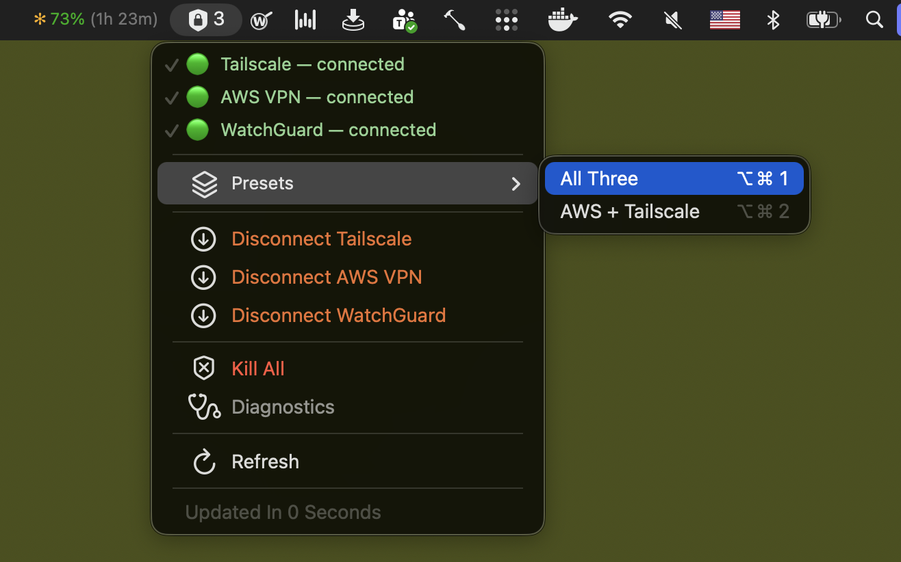

# OFSZ Tooling

VPN kezelő macOS-re — Tailscale, AWS VPN és GlobalProtect egy helyről.

- **Perzisztens AWS kapcsolat, böngésző nélkül** — Az AWS VPN Clientnek nem kell futnia.
- **Perzisztens céges VPN, GlobalProtect app nélkül** — a GlobalProtect klienst nem kell telepíteni sem.
- **A VPN-ek nem akadnak össze**

## Telepítés

```bash
curl -fsSL https://raw.githubusercontent.com/sarimarton-ofsz/ofsz-tooling/main/setup.sh | bash
```

A telepítő mindent elintéz: letölti a szükséges eszközöket, bekéri a jelszavakat, és beállítja a menüsáv ikont. A jelszavakat a Keychainben tárolja. A scriptek a `~/.local/share/ofsz-tooling/`-ba, a futásidejű adatok a `~/.config/ofsz-tooling/`-ba kerülnek.

<details>
<summary>CI / GlobalProtect nélküli telepítés</summary>

```bash
curl -fsSL https://raw.githubusercontent.com/sarimarton-ofsz/ofsz-tooling/main/setup.sh | bash -s -- --disable-gp
```

</details>

### Előfeltételek

Ezeket kézzel kell telepíteni a futtatás előtt:

| Alkalmazás | Honnan |
|---|---|
| AWS VPN Client | https://self-service.clientvpn.amazonaws.com/endpoints/cvpn-endpoint-022755a701a9c6b8c |
| Tailscale | https://tailscale.com/download/mac |

> **Fontos:** Az AWS VPN Client-hez csatlakozz egyszer kézzel a GUI-n keresztül a telepítő futtatása előtt. Ez létrehozza a szükséges profilt, amit a CLI utána átvesz. Utána a kliensből ki lehet lépni, és nem kell többet futtatni.

## Használat

A menüsávban megjelenik egy VPN ikon — onnan minden elérhető.

<p align="center"></p>

<details>
<summary>Terminálból (nem szükséges a használathoz)</summary>

```
vpn preset all          # Mind a három (AWS → GlobalProtect → Tailscale)
vpn preset aws-ts       # AWS + Tailscale
vpn aws-up / aws-down   # AWS VPN
vpn ts-up / ts-down     # Tailscale
vpn gp-up / gp-down     # GlobalProtect
vpn kill-all            # Minden lecsatlakoztatása
vpn status              # Állapot
vpn check               # Hálózati diagnosztika
```

</details>

## Frissítés

Futtasd újra a telepítő parancsot.

## Eltávolítás

```bash
bash ~/.local/share/ofsz-tooling/uninstall.sh
```

---

<details>
<summary><h2 style="display:inline">Hogyan működik?</h2></summary>

### AWS VPN

Az AWS VPN Client egy böngészőflow-val kiegészített, wrappelt OpenVPN: a kliens az AWS szervertől kap egy URL-t, nyit rá egy böngészőt, azon történik egy interaktív Entra login, majd a böngésző POST-ol egy SAML tokent egy helyi ad-hoc szerverre. A token birtokában indul a tényleges VPN tunnel.

Ez a toolkit kiváltja a böngészőflow-t: háttérben futó Playwright automatizálja az Entra logint (kitölti a mezőket a Keychainben tárolt adatokkal), elkapja a SAML választ, és továbbadja az OpenVPN-nek. A session state megmarad, így újracsatlakozáskor általában nem kell újra bejelentkezni. Az AWS VPN Client GUI-ját csak egyszer kell futtatni ezen tool telepítése előtt, utána többet nincs rá szükség.

### GlobalProtect

A GlobalProtect szabványos SSL VPN protokollt használ, amit az `openconnect` nyílt forrású kliens natívan támogat (`--protocol=gp`). Így a Palo Alto saját kliensére nincs szükség.

A VPN-ek akadását az okozta, hogy a GlobalProtect full-DNS módban van, ami a teljes DNS-forgalmat a VPN-en keresztül irányítja. Ezt leszűkítettük a releváns domainekre (`ofsz.hu`, `ofsz.local`) a macOS natív `/etc/resolver/` mechanizmusán keresztül — minden más a publikus resolveren marad. Így a VPN-ek nem zavarják egymás forgalmát.

### Tailscale

A Tailscale saját klienssel fut, a toolkit csak be- és kikapcsolja. A Tailscale eleve WireGuard-alapú, split-tunneles mesh VPN — nem igényel route- vagy DNS-trükközést, out of the box együttműködik a többi VPN-nel.

</details>
